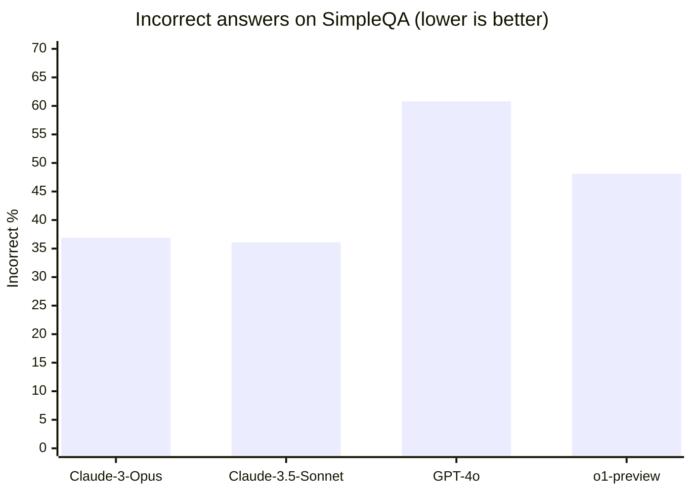
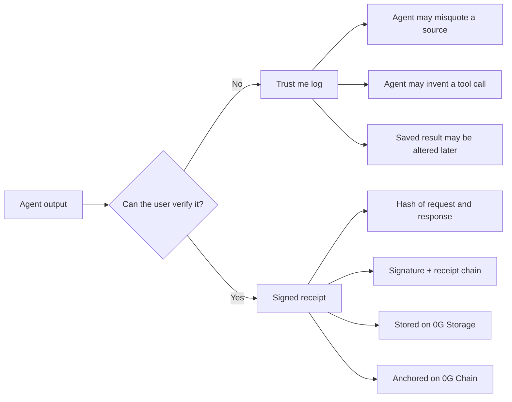
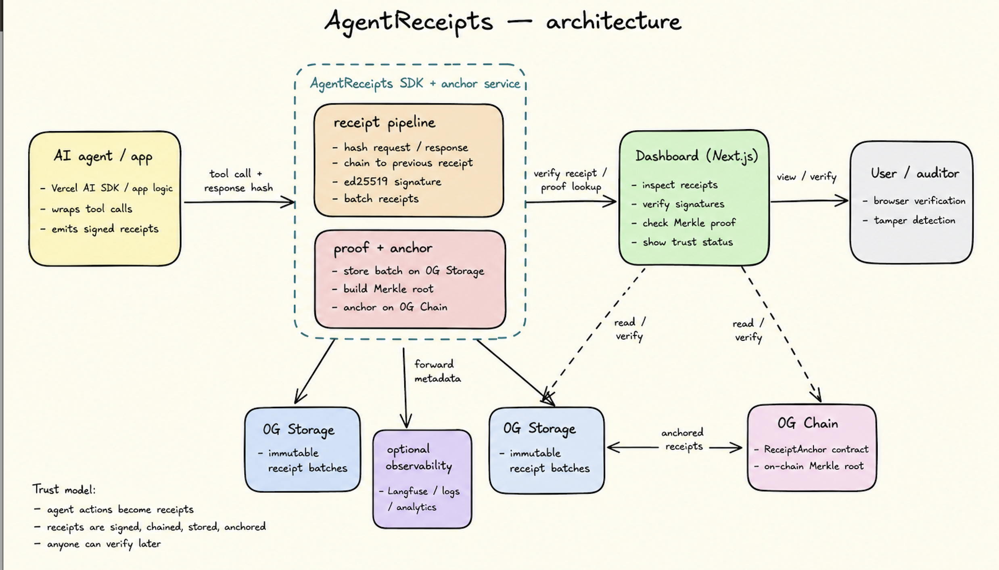

# AgentReceipts

**Tamper-proof receipts for AI agent tool calls, anchored on 0G Chain.**

---

## What is AgentReceipts?

AgentReceipts is an SDK and verification service that wraps every HTTP tool call made by an AI agent into a cryptographically signed, hash-chained receipt. Each receipt captures the URL that was fetched, a SHA-256 hash of the exact response body, the agent's ed25519 signature, and a pointer to the previous receipt in the chain. Batches of receipts are anchored to 0G Chain mainnet via Merkle roots, and individual receipts are stored on 0G Storage. Any party — the user, an auditor, or another agent — can later re-fetch the URL, recompute the hash, verify the signature, and confirm that the on-chain Merkle proof is valid. If the agent tampered with any receipt, the verification fails.

---

## The Problem

AI agents increasingly act autonomously: browsing the web, calling APIs, reading documents, and taking actions on behalf of users. But there is still no standard way to prove what an agent actually saw, what tool it really called, or whether the result was modified later.

That creates three practical failure modes:

- **Hallucinated evidence**: an agent says it fetched a source, but its summary does not match the real content.
- **Phantom tool calls**: an agent claims a tool call happened when it never did.
- **Post-hoc tampering**: someone changes the saved result after the agent run and presents it as authentic.

### Example

> **User:** "Research this token and tell me whether the team announced a mainnet launch."  
> **Agent:** "I fetched the official blog and the team confirmed mainnet is live."  
> **Reality:** the blog either said something else, the agent read a different URL, or the stored response was edited later.

Without receipts, the user has no way to prove what the agent actually fetched. With AgentReceipts, that exact tool call becomes a signed, chained, tamper-evident record that can be verified later.

### Why this matters now

In OpenAI's **SimpleQA** factuality benchmark, frontier models were still marked **incorrect on 36.1% to 60.8% of prompts** in the evaluated set, depending on model. That does **not** mean every agent is unusable, but it does mean that "the agent said so" is not a strong enough trust model for systems that browse, research, or make decisions on behalf of users.[^simpleqa]



### What breaks without cryptographic receipts?



AgentReceipts exists to replace "trust me" agent logs with verifiable proof.

---

## Architecture



```
Agent code
    |
    v
wrapFetch (SDK)
  - executes the real HTTP request
  - SHA-256 hashes the raw response bytes
  - builds a receipt (URL, method, request hash, response hash, status, excerpt)
  - chains it: prev_receipt_hash = SHA-256(previous receipt)
  - signs the canonical JSON with the agent's ed25519 private key
    |
    v
signed Receipt
    |
    +---> 0G Storage (Turbo network)
    |       receipt stored as receipts/{receipt_id}.json
    |
    +---> Anchor Service (POST /anchor)
            - batches receipts
            - builds Merkle tree over receipt hashes
            - calls ReceiptAnchor.anchorBatch(batchId, merkleRoot, count)
            |
            v
        0G Chain mainnet
        ReceiptAnchor contract
        Merkle root stored on-chain permanently
            |
            v
        Anchor Service (POST /verify)
            1. re-fetches tool_url, recomputes SHA-256 → url_valid
            2. verifies ed25519 signature               → signature_valid
            3. verifies prev_receipt_hash chain         → chain_valid
            4. checks Merkle proof against on-chain root → anchor_valid
            |
            v
        { overall: true } or { overall: false, detail: "..." }
```

---

## 0G Integration

### 0G Storage

Receipts and batch manifests are stored on 0G Storage using the Turbo network. The SDK uses `MemData` from `@0gfoundation/0g-storage-ts-sdk` to upload receipt JSON directly from memory — no temporary files. The storage indexer is at `https://indexer-storage-turbo.0g.ai`.

### 0G Chain

The `ReceiptAnchor` smart contract on 0G Chain mainnet (Chain ID 16661) stores one Merkle root per batch. Anchoring a batch of receipts requires a single on-chain transaction, regardless of how many receipts are in the batch. The Merkle proof for any individual receipt can be verified against the on-chain root without re-reading all other receipts.

**Deployed contract:**
`0xcB33A8b65a599767301DcA89a8EdB15e8c4465E3`
Explorer: https://chainscan.0g.ai/address/0xcB33A8b65a599767301DcA89a8EdB15e8c4465E3

**Contract interface:**
```solidity
function anchorBatch(bytes32 batchId, bytes32 merkleRoot, uint256 receiptCount) external;
function getBatchRoot(bytes32 batchId) external view returns (bytes32);
```

---

## Running Locally

### Prerequisites

- Node.js 18+
- A 0G mainnet wallet with OG tokens (for anchoring transactions)

### 1. Anchor service

```bash
cd anchor-service
cp .env.example .env          # add PRIVATE_KEY=0x...
npm install
npm run dev                   # listens on http://localhost:3000
```

### 2. Dashboard

```bash
cd dashboard
cp .env.local.example .env.local   # NEXT_PUBLIC_ANCHOR_SERVICE_URL=http://localhost:3000
npm install
npm run dev                        # opens on http://localhost:3001
```

### 3. E2E test (SDK + anchor + verify)

With the anchor service running:

```bash
cd examples
npm install
npm run e2e
```

Expected output:
```
agent_pubkey: <hex>

Fetching: https://raw.githubusercontent.com/bitcoin/bitcoin/master/COPYING
receipt_id: <uuid>
tool_response_hash: <sha256>

POST /anchor …
batch_id: <hex>
tx_hash: <0x...>

POST /verify …
  url_valid:        true
  signature_valid:  true
  chain_valid:      true
  anchor_valid:     true
  overall:          true

PASS — overall: true
```

---

## Tamper Demo

The dashboard includes a tamper demo that shows why on-chain anchoring matters.

It takes the first receipt loaded from the anchor service, replaces its `tool_response_hash` with 64 zero bytes, and submits it to the verification endpoint as if it were legitimate. The verifier re-fetches the original URL, recomputes the real SHA-256, and finds a mismatch — returning `url_valid: false` and `overall: false`.

This simulates an agent that altered a receipt after the fact: it claimed to have seen one response, but the hash it recorded does not match what is actually at that URL. Because the correct hash was committed to 0G Chain before the tamper attempt, the forgery is detected immediately.

---

## Tech Stack

| Component | Technology |
|-----------|-----------|
| SDK | TypeScript, `@noble/ed25519`, `canonicalize`, `merkletreejs` |
| Anchor service | Node.js, Express |
| Smart contract | Solidity 0.8.24, Hardhat |
| Storage | `@0gfoundation/0g-storage-ts-sdk`, MemData, Turbo network |
| Dashboard | Next.js 16, Tailwind CSS, shadcn/ui |

---

## Track

**Track 3 — Agentic Economy**

AgentReceipts provides the trust layer that agentic economies require. When AI agents transact, negotiate, and act on behalf of humans, every tool call becomes a legal and economic event. AgentReceipts makes those events auditable, tamper-evident, and verifiable by any party — without requiring trust in the agent itself.

---

*Built for the 0G APAC Hackathon, May 2026.*

[^simpleqa]: Source: OpenAI, *Introducing SimpleQA* and *Measuring short-form factuality in large language models* (Oct 30, 2024). Benchmark table reports incorrect-answer rates of 36.9% (Claude 3 Opus), 36.1% (Claude 3.5 Sonnet), 60.8% (GPT-4o), and 48.1% (o1-preview). https://openai.com/index/introducing-simpleqa/ and https://cdn.openai.com/papers/simpleqa.pdf
